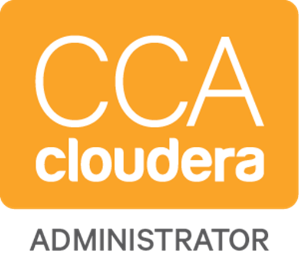

# Hi, welcome to my GitHub! 

I'm a cloud solution architect focused on data and AI at <strong><a href="https://microsoft.com/">Microsoft</a></strong>. 

I've been working with technology since 2012, and during this time I worked with the most diverse types of projects like: gamming programming, web programming, network management systems, business Intelligence and big data (data engineering and architecture). 

Although, what enchanted me the most was working with data projects because today we have an huge amount of data everywhere and using the right technologies, we can get answers to solve big problems, impacting all society and making a world better place.

Some data projects that are already making the world a better place: <strong><a href="https://www.microsoft.com/en-us/ai/ai-for-good">AI for Good</a></strong>

## 👩‍💻 About me
* 💻 Love Programmming
* 🌟 My favorite programming language is Python
* 👩‍🏫 Love teach and share my tecnology knowlodge
* 🔭 As a challange lover, I am venturing into the data science world
* 🏞️ I love travel, the image above is from one of the beatiful places that I went, the <a href="https://www.google.com/maps/place/51%C2%B026'25.4%22N+116%C2%B032'30.3%22W/@51.4403895,-116.5439459,17z/data=!4m5!3m4!1s0x0:0x0!8m2!3d51.4403895!4d-116.5417572">Emerald Lake</a> 
* 🐶 I have the best friend in the world, his name is <a href="https://www.instagram.com/littlefrodothedog/">Frodo</a>

 

</a>

📕 **My Current Certifications**

 
 
 

📕 **My Old Certifications**

 

   <!--
 
**anacaroliness9/anacaroliness9** is a ✨ _special_ ✨ repository because its `README.md` (this file) appears on your GitHub profile.

Here are some ideas to get you started:

- 🔭 I’m currently working on ...
- 🌱 I’m currently learning ...
- 👯 I’m looking to collaborate on ...
- 🤔 I’m looking for help with ...
- 💬 Ask me about ...
- 📫 How to reach me: ...
- 😄 Pronouns: ...
- ⚡ Fun fact: ...
</a>
-->